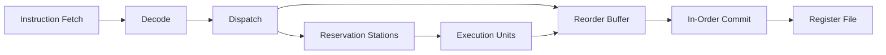
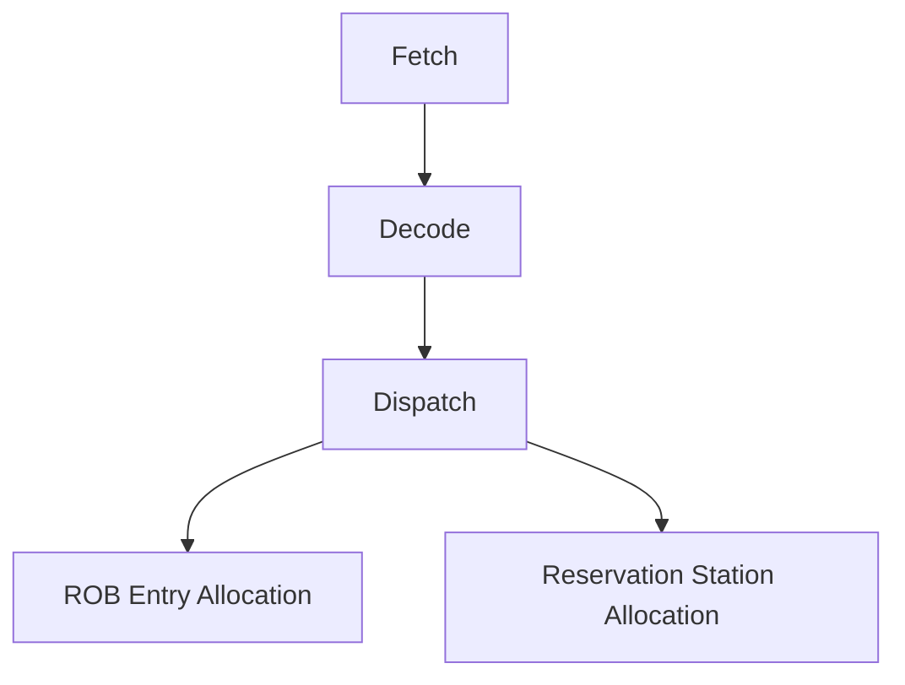
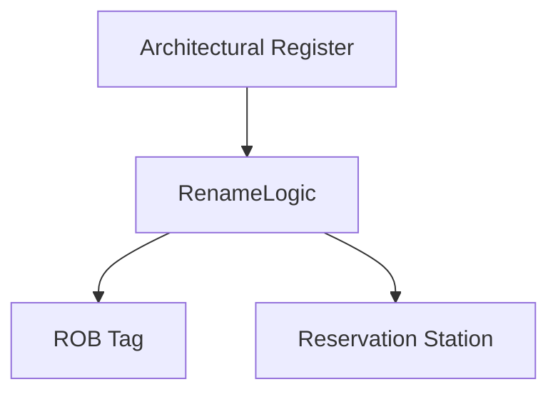
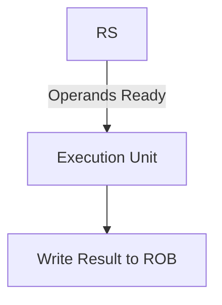
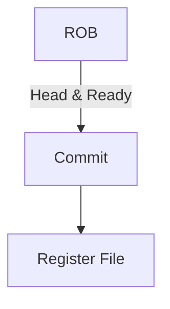
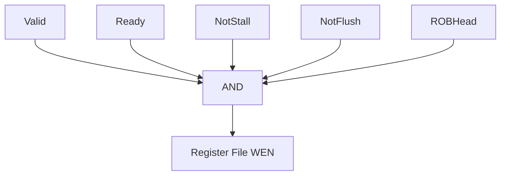

 Project Overview

This project implements a **Tomasulo-style Out-of-Order (OoO) processor** augmented with a **Reorder Buffer (ROB)** to achieve **high Instruction-Level Parallelism (ILP)** while maintaining **precise architectural state**.

The design allows instructions to:

* Execute **out of program order**
* Resolve **WAW and WAR hazards** via register renaming
* Commit results **strictly in program order**

Formal verification using **NuSMV** guarantees correctness under all pipeline scenarios, including stalls and flushes.

---

##  High-Level Microarchitecture

At a high level, the processor follows a **split execution model**:

* **In-order front-end** (Fetch, Decode, Dispatch)
* **Out-of-order execution core**
* **In-order commit stage**



---

##  Tomasulo + ROB Execution Workflow


### 1️ Instruction Fetch & Dispatch (In-Order)

* Instructions are fetched and decoded **in program order**
* Each instruction is allocated:

  * A **ROB entry**
  * A **Reservation Station**
* The ROB preserves program order, enabling precise recovery



---

### 2️ Register Renaming & Dependency Resolution

To eliminate false dependencies:

* Architectural registers (e.g., `x0–x31`) are **renamed**
* Destination registers are mapped to:

  * ROB indices or physical registers
* Source operands track either:

  * Immediate values, or
  * Pending ROB producers



✔️ **Effect:**

* No **WAW (Write After Write)** hazards
* No **WAR (Write After Read)** hazards

---

### 3 Out-of-Order Execution (Tomasulo Core)

* Instructions wait in Reservation Stations
* Execution begins **as soon as operands are ready**
* Older instructions may execute later than younger ones



Example:

* `DIV` (older, 20 cycles)
* `ADD` (younger, 1 cycle)
   `ADD` completes first without violating correctness

---

### 4️ Reorder Buffer (ROB) & In-Order Commit

The ROB ensures **precise state**:

* Results are written **only to the ROB**
* Architectural state updates occur **only at commit**
* Commit conditions:

  * Instruction is at **ROB head**
  * **Ready bit = 1**
  * No **stall** or **flush**



🚨 **On Branch Misprediction or Exception**

* ROB flushes all younger instructions
* Register File remains uncorrupted

---

## Performance Characteristics

The processor achieves **optimal single-issue commit behavior**:

```text
Performance Metrics Summary:
-----------------------------------------------------------
Metric                  | Result      | Target
-----------------------------------------------------------
Commit Throughput (IPC) | 1.0         | 1.0 (Optimal)
Commit Latency          | 1 cycle     | 1 cycle
WAW Resolution Time     | 1 cycle     | <= 2 cycles
Stall Resume Latency    | 1 cycle     | < 2 cycles
-----------------------------------------------------------
```

---


##  Formal Verification Using NuSMV (CTL & LTL)

To guarantee **precise architectural state** despite out-of-order execution, the processor was formally verified using **NuSMV model checking**.
Both **Computation Tree Logic (CTL)** and **Linear Temporal Logic (LTL)** properties were specified and proven to hold under **all reachable states** of the design.

The verification focuses on **commit correctness**, **program-order preservation**, and **safe handling of stalls and flushes**.

---

###  Property P1 — Single Writer Guarantee

**Intent:**
At most **one instruction** can update the architectural Register File in any given cycle.

#### CTL Property

```smv
SPEC AG !(rf_wen_0 & rf_wen_1)
```

 Meaning:

> For **all paths (A)** and **all states (G)**, it is never true that more than one write-enable is asserted simultaneously.

---

###  Property P2 — In-Order Commit (Program Order)

**Intent:**
Even though instructions execute out-of-order, **all architectural updates must occur strictly in program order**, enforced by the ROB head pointer.

#### CTL Property

```smv
SPEC AG (rf_wen -> (rob_head_valid & rob_head_ready))
```

✔️ Meaning:

> A register write can only occur if the instruction is:
>
> * At the **ROB head**
> * Marked **ready for commit**

---

###  Property P3 — No Commit During Stall or Flush

**Intent:**
The architectural state must remain unchanged during pipeline hazards such as:

* Structural or control **stalls**
* Branch misprediction **flushes**

#### LTL Property

```smv
LTLSPEC G ((stall | flush) -> !rf_wen)
```

✔️ Meaning:

> **Globally (G)**, whenever a stall or flush is active, **no register write** is allowed.

---

###  Property P4 — Eventual Commit of Ready Instructions

**Intent:**
Any instruction that becomes ready at the ROB head will **eventually commit**, ensuring forward progress.

#### LTL Property

```smv
LTLSPEC G ((rob_head_valid & rob_head_ready & !stall & !flush)
          -> F rf_wen)
```

✔️ Meaning:

> If an instruction is valid, ready, and not blocked, it will **eventually (F)** be written to the Register File.

---

###  Property P5 — ROB Ordering Consistency

**Intent:**
The ROB head pointer always advances in program order and never skips older instructions.

#### CTL Property

```smv
SPEC AG (rob_head_next = rob_head + 1 | rob_empty)
```

✔️ Meaning:

> The ROB behaves as a **strict FIFO queue**, guaranteeing precise state recovery.

---

###  Verification Summary

| Property | Logic | Guarantee |
|--------|------|----------|
| P1 | CTL | Single architectural writer |
| P2 | CTL | In-order commit |
| P3 | LTL | Safe stall/flush handling |
| P4 | LTL | Forward progress |
| P5 | CTL | ROB ordering correctness |

✔️ All properties were **successfully proven** with no counterexamples, confirming that the processor maintains **precise exceptions**, **correct renaming behavior**, and **architectural integrity** under all execution scenarios.

---


##  Hardware Control Logic: Register File Write Enable

The final **Register File Write Enable (WEN)** signal is generated using a **minimized Boolean control function**.
Register File Write Enable (WEN) — Boolean Minimization

To ensure zero-latency and minimal hardware overhead, the final Register File Write Enable (WEN) signal was derived using Espresso, a logic minimization tool widely used in hardware design.

The goal was to formally minimize the commit condition while preserving all correctness guarantees proven during verification.

 Espresso Logic Minimization (Terminal Output)
```smv

srikar@srikar-Virtual-Machine:~/Downloads$ ./espresso.linux -o
eqntott test.in

(warning): input line #4 ignored
This defines the single condition (minterm) where WEN must be
HIGH (1):

(warning): input line #6 ignored
WEN = Valid AND Ready AND NOT Stall AND WritesReg

(warning): input line #8 ignored
Minterm : I0 = 1, I1 = 1, I2 = 0, I3 = 1
```
🧩 Derived Boolean Function

From the minimized truth table, Espresso produces the following canonical control expression:

WEN = valid & ready & !stall & writes_reg
🔍 Signal Semantics
Signal	Description
valid	Instruction at ROB head is valid
ready	Instruction execution has completed
stall	Pipeline stall condition
writes_reg	Instruction updates architectural register
### Commit Enable Conditions

An instruction commits **only if all conditions hold**:

* Instruction is **Valid**
* Execution is **Complete (Ready)**
* Pipeline is **Not Stalled**
* No **Flush** is active
* Instruction is at **ROB Head**



✔️ This logic ensures **safe, precise, and deterministic updates** to the architectural state.

---

##  Summary

This project demonstrates:

* A **fully functional Tomasulo + ROB OoO processor**
* Clean separation of **execution chaos** and **commit order**
* **Formally verified correctness**
* Hardware-efficient control logic

It serves as a strong foundation for:

* Superscalar extensions
* Branch prediction
* Load/store queues
* Physical register files

---


